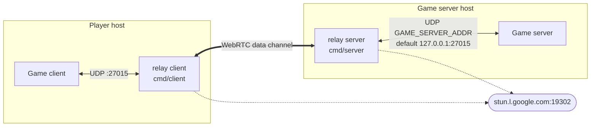

# retrolan

Peer-to-peer LAN tunnel over WebRTC for older multiplayer games whose networking is built around local-network discovery and per-packet UDP (Counter-Strike 1.6, Quake-era titles, and similar). Each player runs the relay **client**, which appears locally as a LAN game server on UDP port `27015` and forwards the game's traffic over a WebRTC data channel to the relay **server**, which sits next to the actual game server and replays the traffic into it as if it came from a local LAN player.

The project is an early-stage foundation — the WebRTC pipe and bidirectional UDP relay are in place; multi-client fan-out, NAT traversal beyond STUN, and a real signaling channel are deliberately deferred.

## Architecture



Data flow:

1. The game broadcasts on UDP `:27015` looking for LAN servers; the relay client receives it.
2. The relay client forwards the bytes through the WebRTC data channel.
3. The relay server writes them to the local game server, which sees them as coming from an ordinary LAN client.
4. Game-server replies travel back the same path: game server → relay server → data channel → relay client → game.

There is no signaling server. The SDP offer/answer exchange happens through two files (`offer1` and `answer1`) written into a shared working directory; both processes must run from the same `cwd` for the handshake to complete. STUN (`stun.l.google.com:19302`) is used for ICE candidate gathering.

## Build

```bash
go build -o bin/client ./cmd/client
go build -o bin/server ./cmd/server
```

Or run without building:

```bash
go run ./cmd/server
go run ./cmd/client
```

Tests:

```bash
go test ./...
```

## Run

Start both processes from the **same directory** so they can hand the offer/answer files to each other:

```bash
# terminal 1
./bin/server

# terminal 2
./bin/client
```

Override the address of the upstream game server (default `127.0.0.1:27015`):

```bash
GAME_SERVER_ADDR=192.168.1.10:27015 ./bin/server
```

## Configuration

| Variable            | Default            | Side   | Purpose                                       |
| ------------------- | ------------------ | ------ | --------------------------------------------- |
| `GAME_SERVER_ADDR`  | `127.0.0.1:27015`  | server | UDP address of the upstream game server.      |

The following addresses are currently hardcoded and conflict if more than one relay instance runs on the same host:

- Client WebRTC ICE mux: `127.0.0.2`
- Client UDP listener: `:27015` (all interfaces; matches the GoldSrc/Source default — games on other ports need a code change for now)
- Server WebRTC ICE mux: `127.0.0.3`

## Status & limitations

- **One pair at a time.** The relay server exits when its peer connection closes; only one client can connect to one server.
- **Single local game source.** The relay client tracks only the most recent local UDP source address, so two game instances on the same player host share state.
- **File-based signaling.** Hand-off is via files in a shared cwd — fine for prototyping, not for real deployments.
- **STUN only.** No TURN; symmetric NATs on both ends will not connect.

## License

MIT — see [LICENSE](LICENSE).
