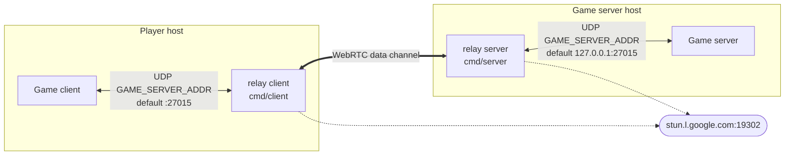

# retrolan

Peer-to-peer LAN tunnel over WebRTC for older multiplayer games whose networking is built around local-network discovery and per-packet UDP (Counter-Strike 1.6, Quake-era titles, and similar). Each player runs the relay **client**, which appears locally as a LAN game server on UDP port `27015` and forwards the game's traffic over a WebRTC data channel to the relay **server**, which sits next to the actual game server and replays the traffic into it as if it came from a local LAN player.

The project is an early-stage foundation — the WebRTC pipe and bidirectional UDP relay are in place; multi-client fan-out, NAT traversal beyond STUN, and a real signaling channel are deliberately deferred.

## Architecture



Data flow:

1. The game broadcasts on UDP `:27015` looking for LAN servers; the relay client receives it.
2. The relay client forwards the bytes through the WebRTC data channel.
3. The relay server writes them to the local game server, which sees them as coming from an ordinary LAN client.
4. Game-server replies travel back the same path: game server → relay server → data channel → relay client → game.

There is no signaling server. The SDP offer/answer exchange happens through two files (`offer1` and `answer1`) written into a shared working directory; both processes must run from the same `cwd` for the handshake to complete. STUN (`stun.l.google.com:19302`) is used for ICE candidate gathering.

## Build

```bash
go build -o bin/client   ./cmd/client
go build -o bin/server   ./cmd/server
go build -o bin/mockgame ./cmd/mockgame   # optional helper, see below
```

Or run without building:

```bash
go run ./cmd/server
go run ./cmd/client
go run ./cmd/mockgame
```

Tests:

```bash
go test ./...
```

## Run

Start both processes from the **same directory** so they can hand the offer/answer files to each other:

```bash
# terminal 1
./bin/server

# terminal 2
./bin/client
```

Override the address of the upstream game server (default `127.0.0.1:27015`):

```bash
GAME_SERVER_ADDR=192.168.1.10:27015 ./bin/server
```

Or change the client's local listen address (default `:27015`, all interfaces):

```bash
GAME_SERVER_ADDR=127.0.0.1:27016 ./bin/client
```

## Sending raw UDP datagrams to the client

Without a real game you can drive the relay end-to-end with `netcat`. With both `./bin/client` and `./bin/server` running, in a third terminal stand up a fake game server next to `./bin/server`:

```bash
nc -u -l 127.0.0.1 27015
```

In a fourth terminal, send a datagram into the client's game port:

```bash
echo "hello from the LAN" | nc -u -w1 127.0.0.1 27015
```

The bytes flow `nc → client (UDP :27015) → WebRTC data channel → server → nc -l (UDP 127.0.0.1:27015)` and appear in the listener. Anything you type into the listener `nc` travels back the same path; the relay client replies to the most recent UDP source it saw, so use an interactive session if you want bidirectional traffic:

```bash
nc -u 127.0.0.1 27015
```

A one-shot send with Bash's built-in UDP redirection works too — handy when `nc` isn't installed:

```bash
echo -n "ping" > /dev/udp/127.0.0.1/27015
```

## Mock game server

`cmd/mockgame` is a small helper for driving either end of the relay without a real game. It exposes:

- a UDP **listener** on `MOCK_LISTEN_ADDR` (default `:27015`) that **echoes** every datagram back to its source — drop it next to the relay server (as a fake upstream game server) or next to the relay client (as a fake game replying to probes);
- a UDP **sender** on an ephemeral local port that writes to `MOCK_TARGET_ADDR` (default `127.0.0.1:27016`) — used to inject arbitrary payloads into either end of the pipe;
- a tiny **web UI** at `MOCK_HTTP_ADDR` (default `:8080`) that streams sent/received messages on both sockets in real time over Server-Sent Events (no manual refresh) and exposes a text box for sending.

Run it on its own to confirm the binary works:

```bash
./bin/mockgame
# open http://localhost:8080
echo -n "ping" > /dev/udp/127.0.0.1/27015   # appears in the listener panel as rx + tx (echoed)
```

Typical loopback wiring for an end-to-end test on a single host (note the relay client and a default mockgame both want `:27015`, so move one of them):

```bash
# pretend to be the upstream game server, on :27016
MOCK_LISTEN_ADDR=:27016 MOCK_HTTP_ADDR=:8081 ./bin/mockgame

# relay server, dialing the mockgame above for each WebRTC peer
GAME_SERVER_ADDR=127.0.0.1:27016 ./bin/server

# relay client, listening for "game" traffic on :27015 (default)
./bin/client

# pretend to be the game; sender targets the relay client's listen port
MOCK_TARGET_ADDR=127.0.0.1:27015 MOCK_HTTP_ADDR=:8080 ./bin/mockgame
```

Now the `:8080` UI lets you push payloads into the relay client; the `:8081` UI shows them arriving at the upstream side and being echoed back through the data channel.

## Configuration

| Variable            | Default            | Side     | Purpose                                                                  |
| ------------------- | ------------------ | -------- | ------------------------------------------------------------------------ |
| `GAME_SERVER_ADDR`  | `:27015`           | client   | UDP listen address for the local game (all interfaces by default).       |
| `GAME_SERVER_ADDR`  | `127.0.0.1:27015`  | server   | UDP address of the upstream game server to dial for each relayed peer.   |
| `MOCK_HTTP_ADDR`    | `:8080`            | mockgame | HTTP listen address for the web UI.                                      |
| `MOCK_LISTEN_ADDR`  | `:27015`           | mockgame | UDP listen address; every datagram is echoed back to its source.         |
| `MOCK_TARGET_ADDR`  | `127.0.0.1:27016`  | mockgame | Target for outbound datagrams sent from the web UI.                      |

The following addresses are currently hardcoded and conflict if more than one relay instance runs on the same host:

- Client WebRTC ICE mux: `127.0.0.2`
- Server WebRTC ICE mux: `127.0.0.3`

## Status & limitations

- **One pair at a time.** The relay server exits when its peer connection closes; only one client can connect to one server.
- **Single local game source.** The relay client tracks only the most recent local UDP source address, so two game instances on the same player host share state.
- **File-based signaling.** Hand-off is via files in a shared cwd — fine for prototyping, not for real deployments.
- **STUN only.** No TURN; symmetric NATs on both ends will not connect.

## License

MIT — see [LICENSE](LICENSE).
